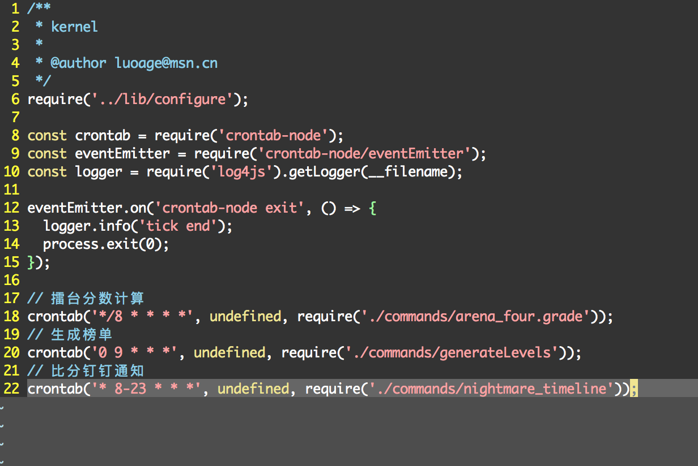

# crontab-node

```
yarn add crontab-node
```

crontab-node目的是配合linux的crontab使用, 需要每分钟执行一次，时间触发后才会执行函数方法



## Example

c.js

```
const crontab = require('crontab-node');
const eventEmitter = require('crontab-node/eventEmitter');

eventEmitter.on('crontab-node exit', () => {
	process.exit(0);
});
const promise = new Promise((resolve, reject) => {
    setTimeout(() => {
      resolve();
    }, 1);
});

console.log(new Date());

crontab('*/2 * * * *', () => {
	return promise.then(() => {
		console.log('I am callback, just excute once');
	});
});

```

crontab -l

```
* * * * * node path/c.js
```
